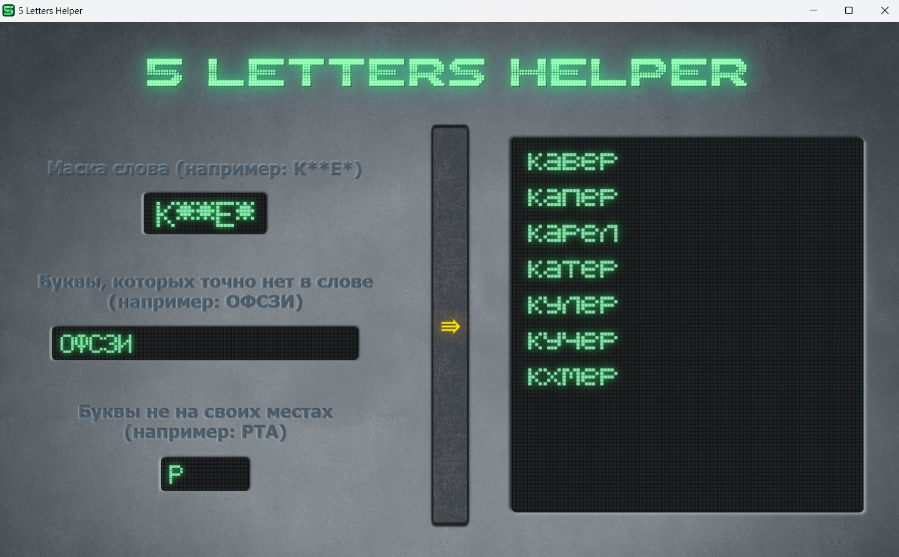

  

<h1 align="center">5 Letters Helper</h1>

  <strong><i>Простой и стильный помощник для решения головоломок со словами.</i></strong>

  

---

## О проекте

**5 Letters Helper** — это десктопное приложение, которое помогает искать и подбирать слова из 5 букв по заданным условиям. Программа полезна для игр вроде «Wordle», «5 букв» или кроссвордов.

Этот проект стал для меня практикой в разработке на C# и WPF. Главной задачей было не просто написать рабочую логику, но и с нуля создать уникальный и атмосферный интерфейс в стиле ретро-электроники.

## Основные возможности и особенности

* **Мгновенная фильтрация:** Поиск по локальному словарю из более чем 4000 пятибуквенных слов происходит моментально.
* **Гибкие фильтры:**
    * Фильтрация по маске (известные буквы на своих местах).
    * Исключение слов с буквами, которых точно нет в нужном слове.
    * Указание букв, которые есть в слове, но находятся не на своих местах.
* **Кастомный UI:** Уникальный пользовательский интерфейс в ретро-стиле в виде металлической панели с VFD-дисплеями, полностью созданный с помощью XAML.
* **Адаптивный дизайн:** Элементы интерфейса и размер шрифта подстраиваются под количество найденных слов.

## Стек технологий

* **C# (.NET 9)**
* **WPF (XAML)**

## 📦 Установка и запуск

1.  Перейдите на страницу **[Releases](https://github.com/Coupsoul/5LettersHelper/releases)**.
2.  Скачайте `.zip` архив с последней версией.
3.  Распакуйте архив в любую удобную папку.
4.  Запустите `5LettersHelper.exe`.
